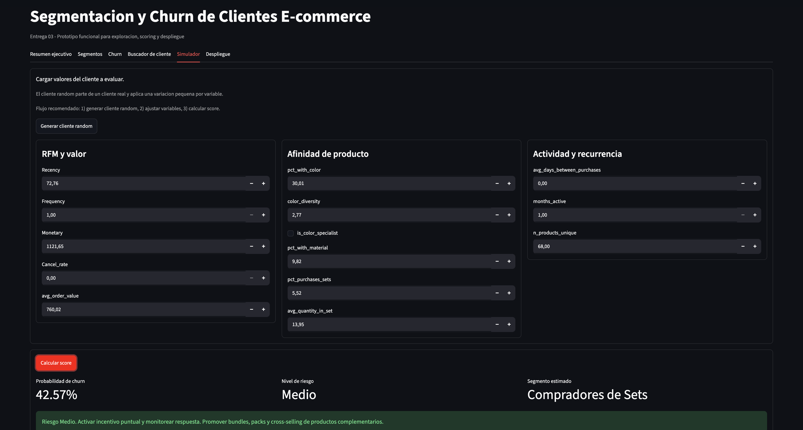

# Segmentación de Clientes y Análisis Comercial en E-commerce

[](https://github.com/charliermarsh/ruff)
[](https://github.com/pre-commit/pre-commit)

**Trabajo Práctico - Ciencia de Datos Aplicada | ITBA | 1er Cuatrimestre 2026 | Grupo 12**

> **Estado actual (03/06/2026):** Entregas 01, 02 y 03 finalizadas. Entrega 04 (despliegue + interfaz + presentación oral) en progreso, con prototipo funcional en Streamlit sobre los modelos persistidos.

---

## Descripción del proyecto

Proyecto de analítica comercial sobre el dataset [Online Retail](https://archive.ics.uci.edu/dataset/352/online+retail) de UCI para segmentar clientes, estimar riesgo de churn y proponer acciones comerciales accionables.

El dataset contiene **541.909 transacciones** de un retailer online del Reino Unido (período: `2010-12-01` a `2011-12-09`). Luego de limpieza se trabaja con **397.884 transacciones válidas**.

## Objetivo de negocio

Construir una solución de datos que permita:

- Segmentar clientes con enfoque RFM + preferencias de producto.
- Detectar clientes con mayor riesgo de churn.
- Priorizar acciones de retención y crecimiento con impacto comercial.

## Resumen por entrega

El Trabajo Práctico se compone de **cuatro entregas**:

| Entrega | Estado | Resultado principal |
|--------|--------|---------------------|
| Entrega 01 - Propuesta de proyecto | Completada | Definición del problema, objetivo de negocio, alcance y elección del dataset. |
| Entrega 02 - Recopilación y preparación de datos | Completada | Adquisición del dataset, EDA, limpieza, RFM y enriquecimiento de productos vía regex. |
| Entrega 03 - Modelado de la solución | Completada | Modelos de segmentación (K-Means) y churn (Random Forest), validación con métricas y persistencia de modelos reutilizables. |
| Entrega 04 - Despliegue y presentación | En progreso | Interfaz funcional en Streamlit sobre los modelos persistidos. Pendiente: capa de servicio/API y presentación oral. |

Este repositorio refleja la evolución completa del trabajo práctico y queda preparado para iteraciones futuras.

## Entrega 03 - Modelado de la solución (completada)

Foco de la entrega: implementación, validación y persistencia de los modelos. Todo el trabajo es reproducible mediante notebooks.

### Modelado y validación

- `notebooks/5-models/07-gc-clustering-2026_04_15.ipynb`
  - Clustering de clientes (K-Means) con features RFM + atributos enriquecidos.
  - Preprocesamiento (log1p + estandarización) empaquetado en un `Pipeline` de scikit-learn, serializado junto al modelo para una inferencia reproducible.
- `notebooks/5-models/08-gc-churn-2026_04_16.ipynb`
  - Modelo supervisado de churn (Random Forest) y evaluación con métricas de clasificación (AUC-ROC, F1, precisión, recall, matriz de confusión).
- `notebooks/6-interpretation/09-gc-analisis_segmentos-2026_04_16.ipynb`
  - Análisis combinado segmentos + churn, interpretación de negocio y reflexión crítica sobre el rendimiento y posibles mejoras.

### Persistencia de modelos (reutilizables sin reentrenar)

- Modelos: `data/06_models/kmeans_model.pkl`, `data/06_models/churn_model.pkl`
- Salidas: `data/07_model_output/clientes_segmentados.parquet`, `data/07_model_output/churn_predictions.parquet`
- Reporting: `data/08_reporting/*.png` (segmentos, churn y evaluación)

## Entrega 04 - Despliegue y presentación (en progreso)

Foco de la entrega: operacionalizar la solución mediante un servicio e interfaz de uso, y comunicarla en una presentación oral.

### Interfaz funcional (prototipo)

- `notebooks/7-deploy/streamlit_app.py`
  - Resumen ejecutivo con KPIs de negocio y validación técnica del modelo de churn.
  - Exploración de segmentos.
  - Ranking de clientes en riesgo.
  - Buscador de cliente.
  - Simulador de nuevos clientes con muestreo aleatorio realista.
  - Sección de propuesta de despliegue.

Vista del prototipo:



### Pendiente

- Capa de servicio (API REST) que exponga los modelos persistidos, separando la lógica de modelo de la capa de servicio.
- Consumo del servicio desde la interfaz.
- Presentación oral del proyecto (10-15 min) con demostración en vivo.

---

## Dataset y enriquecimiento

| Atributo | Detalle |
|----------|---------|
| Fuente | [UCI Machine Learning Repository](https://archive.ics.uci.edu/dataset/352/online+retail) |
| Archivo | `Online Retail.xlsx` |
| Registros | 541.909 originales -> 397.884 válidos |
| Clientes únicos | 4.338 |
| Variables originales | `InvoiceNo`, `StockCode`, `Description`, `Quantity`, `InvoiceDate`, `UnitPrice`, `CustomerID`, `Country` |
| Enriquecimiento | +50 atributos por producto derivados de `Description` (regex) |

Descarga directa del dataset: [online+retail.zip](https://archive.ics.uci.edu/static/public/352/online+retail.zip)

---

## Configuración del entorno

### Requisitos

- Python `>=3.11`
- Git
- (opcional) Make

### Instalación rápida

```bash
git clone https://github.com/gonrc/segmentacion-clientes-ecommerce.git
cd segmentacion-clientes-ecommerce

# Opción recomendada (uv): crea el entorno e instala runtime + dev + docs
uv sync

# Si no tenés uv instalado:
pip install uv && uv sync
```

Esto crea el entorno virtual en `.venv/` con todas las dependencias necesarias (incluido Streamlit para el prototipo).

### Cargar dataset crudo

```bash
curl -L -o data/01_raw/online_retail.zip https://archive.ics.uci.edu/static/public/352/online+retail.zip
unzip data/01_raw/online_retail.zip -d data/01_raw/
```

---

## Ejecución reproducible (pipeline Entrega 03)

Para regenerar artefactos de modelado y reportes:

```bash
.venv/bin/python execute_notebook.py "notebooks/4-feat_eng/06-gc-customer_product_profile-2026_04_01.ipynb"
.venv/bin/python execute_notebook.py "notebooks/5-models/07-gc-clustering-2026_04_15.ipynb"
.venv/bin/python execute_notebook.py "notebooks/5-models/08-gc-churn-2026_04_16.ipynb"
.venv/bin/python execute_notebook.py "notebooks/6-interpretation/09-gc-analisis_segmentos-2026_04_16.ipynb"
```

Si ya existen artefactos previos en `data/`, se recomienda regenerarlos con esta secuencia para asegurar consistencia de resultados.

---

## Ejecutar la app Streamlit

```bash
.venv/bin/streamlit run "notebooks/7-deploy/streamlit_app.py" --server.fileWatcherType none
```

Por defecto queda disponible en `http://127.0.0.1:8501`.

---

## Estructura del proyecto

```text
.
├── conf/
├── data/
│   ├── 01_raw/
│   ├── 02_intermediate/
│   ├── 03_primary/
│   ├── 04_feature/
│   ├── 05_model_input/
│   ├── 06_models/
│   ├── 07_model_output/
│   └── 08_reporting/
├── notebooks/
│   ├── 1-data/
│   ├── 2-exploration/
│   ├── 3-analysis/
│   ├── 4-feat_eng/
│   ├── 5-models/
│   ├── 6-interpretation/
│   ├── 7-deploy/
│   └── 8-reports/
├── src/
├── tests/
├── pyproject.toml
└── README.md
```

## Qué revisar primero (docentes)

Para una revisión rápida de los entregables:

1. `README.md` (este documento).
2. Entrega 03 (modelado):
   - `notebooks/5-models/07-gc-clustering-2026_04_15.ipynb`.
   - `notebooks/5-models/08-gc-churn-2026_04_16.ipynb`.
   - `notebooks/6-interpretation/09-gc-analisis_segmentos-2026_04_16.ipynb`.
3. Entrega 04 (despliegue e interfaz):
   - `notebooks/7-deploy/streamlit_app.py` (prototipo).

## Nota sobre versionado de datos

Los archivos de `data/` están excluidos del repositorio por tamaño.  
Para correr notebooks/app en otra máquina, hay que descargar el dataset y regenerar los artefactos locales.

## Créditos

Proyecto basado en el [data science project template](https://github.com/JoseRZapata/data-science-project-template).
